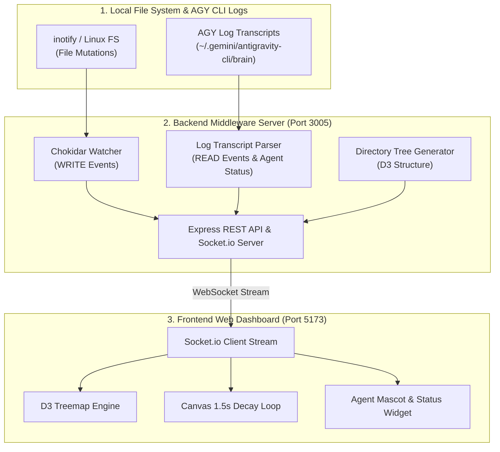

# 🚀 AGY CLI Web Visualizer (`see-agy`)

A **zero-invasive, real-time 2D Treemap visualizer dashboard** for watching **Google Antigravity (AGY) CLI** workspace file mutations, read operations, and agent execution states.


---

## ✨ Features

- 🎨 **D3 Treemap Matrix Visualization**: Renders your entire workspace directory hierarchy as an interactive block grid.
- ⚡ **1.5-Second Visual Decay Loop**:
  - 🟠 **Orange Glow (WRITE)**: Triggered instantly on file addition or modification.
  - 🔵 **Blue Glow (READ)**: Triggered when AGY inspects or searches files (`view_file`, `grep_search`).
  - Smooth 60fps `requestAnimationFrame` linear alpha decay.
- 🤖 **Agent State & Mascot Widget**: Real-time display of active AI models (e.g., `Gemini 3.6 Flash`), session step counters, and dynamic Working / Idle mascot animations.
- 📂 **Dynamic Workspace Switcher**: Change the monitored repository/directory path on the fly directly from the Web UI, environment variables, or REST API.
- 🧪 **E2E Testing Infrastructure & CLI Mock Generator**: Includes 11 automated test suites and a mock event generator script for stress testing.

---

## 📐 System Architecture



---

## 🚀 Quick Start

### Prerequisites
- **Node.js**: v18+ 
- **npm**: v9+

### 1. Install & Start Backend Server
```bash
cd backend
npm install
npm start
```
> The backend will listen on **`http://localhost:3005`** and watch the current project root by default.

### 2. Install & Start Frontend Dashboard
```bash
cd frontend
npm install
npm run dev
```
> Open **`http://localhost:5173`** in your browser to view the live dashboard!

---

## 📂 Switching Monitored Repositories

You can monitor **any repository or directory** on your machine using one of 3 ways:

1. **Web Dashboard UI (Recommended)**:
   - Click the **`Change`** button next to `Repo:` in the top navigation bar.
   - Enter any absolute directory path (e.g., `/home/user/my-project`) and click **Switch Directory**.

2. **Environment Variable / CLI Argument**:
   ```bash
   # Via Environment Variable
   WATCH_DIR=/home/user/my-project npm start

   # Via CLI Argument
   node server.js /home/user/my-project
   ```

3. **REST API**:
   ```bash
   curl -X POST http://localhost:3005/api/watch_dir \
        -H "Content-Type: application/json" \
        -d '{"dir": "/home/user/my-project"}'
   ```

---

## 🧪 Testing & Mock Generators

### Run E2E Test Suite
The repository includes 11 automated End-to-End opaque-box tests covering feature coverage, boundary conditions, rapid event bursts, and session lifecycles:
```bash
node tests/e2e.test.js
```

### Emit Mock Events via CLI
Simulate real-time activity manually:
```bash
# Emit a WRITE event (Orange glow)
node scripts/mock_generator.js -t WRITE -p frontend/src/App.jsx

# Emit a READ event (Blue glow)
node scripts/mock_generator.js -t READ -p backend/server.js

# Trigger Agent Working Status
node scripts/mock_generator.js -s working -m "Gemini 3.6 Flash" -c 42

# Rapid event burst (20 events)
node scripts/mock_generator.js -t WRITE -p frontend/src/App.jsx --burst 20 --delay 10
```

---

## 🛠️ Tech Stack

| Layer | Technologies |
|---|---|
| **Frontend** | React 18, Vite, D3.js (`d3-hierarchy`), Tailwind CSS, Lucide Icons, Socket.io-client |
| **Backend** | Node.js, Express, Socket.io, Chokidar |
| **Testing** | Node Native Test Suite, REST & Socket E2E Test Harness |

---

## 📄 License

This project is open source and available under the [MIT License](LICENSE).
