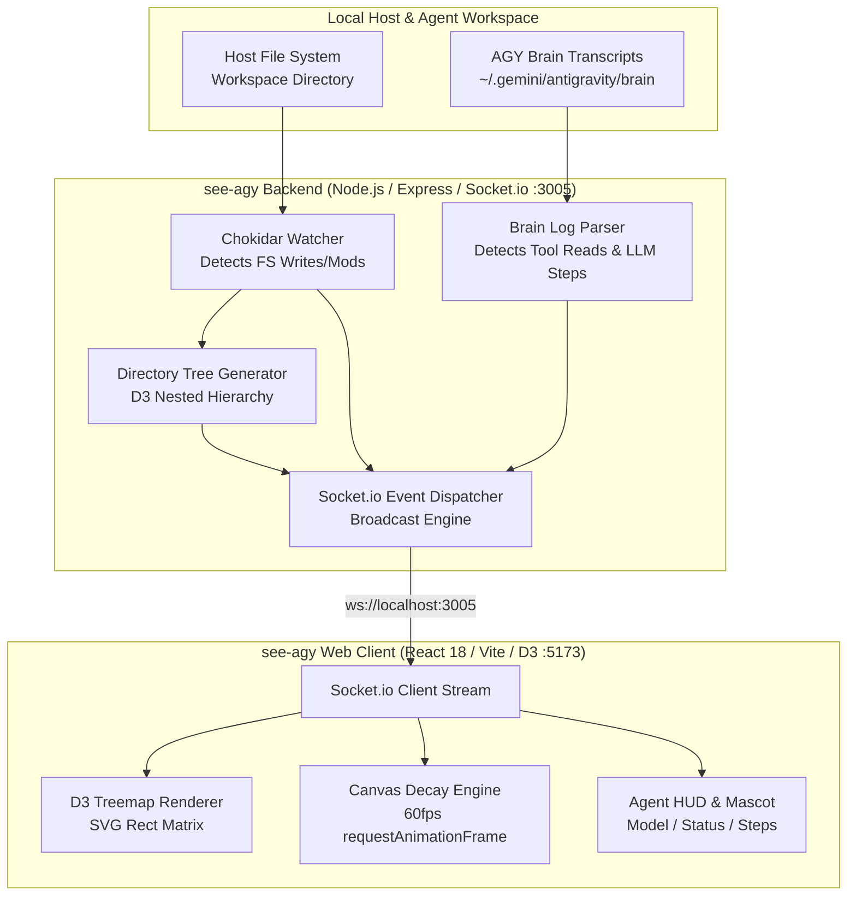

English | [繁體中文](README_zh.md)

# 🚀 see-agy - Antigravity Agent Session Visualizer

[](https://nodejs.org/)
[](https://react.dev/)
[](https://vitejs.dev/)
[](https://d3js.org/)
[](https://tailwindcss.com/)
[](LICENSE)
[](tests/e2e.test.js)

> **see-agy** is a zero-invasive, real-time 2D Treemap visualizer dashboard for monitoring **Google Antigravity (AGY)** AI agent sessions. It live-streams file system mutations, read operations, tool calls, and agent thinking/mascot states with zero modifications to the core agent runtime.

---

## Table of Contents

- [Key Capabilities](#key-capabilities)
- [System Architecture](#system-architecture)
- [Repository Structure](#repository-structure)
- [Prerequisites](#prerequisites)
- [Getting Started & Quick Start](#getting-started--quick-start)
  - [1. Backend Middleware Server](#1-backend-middleware-server)
  - [2. Frontend Web Dashboard](#2-frontend-web-dashboard)
- [Dynamic Workspace Monitoring](#dynamic-workspace-monitoring)
- [Visual Effects & Decay Engine](#visual-effects--decay-engine)
- [Environment Variables & Configuration](#environment-variables--configuration)
- [Testing & Mock Generators](#testing--mock-generators)
- [REST & WebSocket API Reference](#rest--websocket-api-reference)
- [Trademarks & License Notices](#trademarks--license-notices)

---

## Key Capabilities

- 🗺️ **Hierarchical 2D Treemap**: Powered by `d3-hierarchy`, rendering complex multi-tier project directory trees into proportional, interactive file bounding blocks.
- ⚡ **Real-Time 1.5-Second Alpha Decay Engine**:
  - 🟠 **Orange Pulse (WRITE)**: Triggered in real time when files are written, edited, or appended.
  - 🔵 **Blue Pulse (READ)**: Triggered when agent inspection tools (`view_file`, `grep_search`, `read_url_content`) access a file.
  - 60 FPS GPU-accelerated canvas overlay with smooth linear alpha fade-out over 1,500ms.
- 🤖 **Agent State & Mascot HUD**: Heads-Up Display showing active AI models (e.g., `Gemini 3.6 Flash`, `Pro`), cumulative step counts, active tool calls, and reactive idle/working animations.
- 🔄 **Dynamic Workspace Switching**: Switch monitored workspaces on the fly via the Web UI, command-line arguments, environment variables, or HTTP REST endpoints.
- 🛡️ **Zero-Invasive Non-Blocking Architecture**: Reads standard AGY execution logs from `~/.gemini/antigravity/brain` alongside Chokidar OS file events. Requires zero plugins or wrappers injected into your agent.
- 🧪 **Comprehensive Automated Testing**: 11 robust opaque-box End-to-End tests verifying boundary conditions, burst events, and memory stability under high event loads.

---

## System Architecture



---

## Repository Structure

```text
see-agy/
├── backend/
│   ├── package.json          # Backend dependencies (Express, Chokidar, Socket.io)
│   ├── package-lock.json     # Lockfile
│   └── server.js             # Core backend server, log parser, and socket dispatcher
├── frontend/
│   ├── public/               # Static assets & icons
│   ├── src/
│   │   ├── components/       # Treemap, Mascot, Navigation, and Modal components
│   │   ├── App.jsx           # Root dashboard layout and state orchestrator
│   │   ├── index.css         # Tailwind utility styling and animations
│   │   └── main.jsx          # React DOM entrypoint
│   ├── index.html            # Single-page application template
│   ├── package.json          # Frontend dependencies (React, Vite, D3, Lucide)
│   ├── tailwind.config.js    # Tailwind styling definitions
│   └── vite.config.js        # Vite dev server and proxy configuration
├── scripts/
│   └── mock_generator.js     # CLI mock event generator for testing and demos
├── tests/
│   ├── decay_loop_stress.test.js             # Canvas decay performance benchmark
│   ├── e2e.test.js                           # Complete 11-suite E2E test harness
│   └── empirical_stress_and_edge_cases.js     # Edge case and boundary stress validation
├── .gitignore                # Git exclusions (node_modules, logs, build dist)
├── AGENTS.md                 # Agent instructions
├── README.md                 # English documentation
└── README_zh.md              # Traditional Chinese documentation
```

---

## Prerequisites

- **Node.js**: `v18.0.0` or higher (LTS recommended)
- **npm**: `v9.0.0` or higher
- **Modern Browser**: Chrome, Edge, Firefox, or Safari with WebGL and Canvas 2D support

---

## Getting Started & Quick Start

### 1. Backend Middleware Server

```bash
# Navigate to backend directory
cd backend

# Install dependencies
npm install

# Start the server (defaults to watching the parent directory)
npm start
```
> The backend server initializes on **`http://localhost:3005`**.

---

### 2. Frontend Web Dashboard

In a separate terminal window:

```bash
# Navigate to frontend directory
cd frontend

# Install dependencies
npm install

# Start the Vite development server
npm run dev
```
> Open your browser at **`http://localhost:5173`** to access the live visualizer dashboard.

---

## Dynamic Workspace Monitoring

You can monitor any target directory on your machine through three interchangeable workflows:

1. **Dashboard Top Bar (UI Mode)**:
   - Click the **Change** button next to the repository path in the navigation header.
   - Enter an absolute path (e.g., `C:\projects\my-app` or `/home/user/project`) and confirm.
2. **CLI Argument**:
   ```bash
   node server.js "C:\Users\b\workspaceS32DS.3.6.11"
   ```
3. **Environment Variable**:
   ```bash
   WATCH_DIR="/path/to/target/project" npm start
   ```
4. **REST Endpoint**:
   ```bash
   curl -X POST http://localhost:3005/api/watch_dir \
        -H "Content-Type: application/json" \
        -d '{"dir": "C:\\projects\\my-app"}'
   ```

---

## Visual Effects & Decay Engine

| Event Type | Visual Indicator | Visual Effect Specification |
|---|---|---|
| **WRITE** | 🟠 **Orange Pulse** | `#F97316` glowing outline & fill triggered when files are created, updated, or written. |
| **READ** | 🔵 **Blue Pulse** | `#38BDF8` glowing outline & fill triggered when the AI agent reads file contents. |
| **Decay** | 📉 **1.5s Alpha Curve** | Linear opacity interpolation updated every frame (`60fps`) to prevent visual clutter. |
| **Working** | 🏃 **Active Mascot** | Animated SVG mascot indicators displaying currently active LLM steps and tool executions. |
| **Idle** | 😴 **Resting Mascot** | Soft breathing animation displayed when the agent awaits user prompts. |

---

## Environment Variables & Configuration

| Variable | Default Value | Description |
|---|---|---|
| `PORT` | `3005` | HTTP and WebSocket port for the backend service. |
| `WATCH_DIR` | `path.resolve(__dirname, '..')` | Absolute directory path monitored for file changes. |
| `ALLOWED_ORIGINS` | `http://localhost:5173,http://127.0.0.1:5173` | Comma-delimited origins permitted via CORS policies. |
| `BRAIN_DIR` | Auto-detected user home | Path to Antigravity session transcript logs. |

---

## Testing & Mock Generators

### Running the End-to-End Test Suite

Validate all server handlers, tree generators, and socket broadcasts:

```bash
node tests/e2e.test.js
```
*Executes all 11 test suites covering boundary validation, tree updates, and socket telemetry.*

### Emitting Simulated Events via CLI

Test frontend visuals without launching an active agent session:

```bash
# Emit a single WRITE pulse (Orange)
node scripts/mock_generator.js -t WRITE -p frontend/src/App.jsx

# Emit a single READ pulse (Blue)
node scripts/mock_generator.js -t READ -p backend/server.js

# Change Agent Status to Working
node scripts/mock_generator.js -s working -m "Gemini 3.6 Flash" -c 15

# Fire a high-density burst of 25 rapid WRITE events
node scripts/mock_generator.js -t WRITE -p frontend/src/App.jsx --burst 25 --delay 15
```

---

## REST & WebSocket API Reference

### HTTP REST Endpoints

- `GET /api/tree`: Returns the current nested directory hierarchy of the watched workspace.
- `GET /api/status`: Returns current server uptime, watched directory, and connected client count.
- `POST /api/watch_dir`: Updates the active monitored directory path on the fly.

### WebSocket Events (`socket.io`)

- `file:event`: Dispatched on file mutation (`{ path, type: 'WRITE' | 'READ', timestamp }`).
- `tree:update`: Emitted when files/directories are added or removed to refresh tree nodes.
- `agent:status`: Emitted on agent state changes (`{ state: 'working' | 'idle', model, step }`).

---

## Trademarks & License Notices

### Source Code License
This project is open-source software licensed under the **[MIT License](LICENSE)**.

### Trademark Attributions
- **Google®**, **Antigravity™**, and **Gemini™** are trademarks or registered trademarks of Google LLC.
- **Node.js®** is a registered trademark of the OpenJS Foundation.
- **React®** is a registered trademark of Meta Platforms, Inc.
- All other product names, logos, and brands are property of their respective owners.
