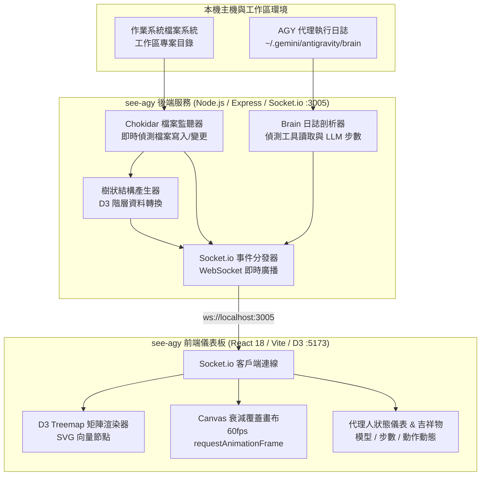

[English](README.md) | 繁體中文

# 🚀 see-agy - Antigravity AI 代理程式工作階段視覺化儀表板

[](https://nodejs.org/)
[](https://react.dev/)
[](https://vitejs.dev/)
[](https://d3js.org/)
[](https://tailwindcss.com/)
[](LICENSE)
[](tests/e2e.test.js)

> **see-agy** 是一款專為 **Google Antigravity (AGY)** AI 代理程式設計的零侵入式、即時 2D 矩形樹狀圖 (Treemap) 視覺化儀表板。無需修改任何 AI 代理核心程式碼，即可零延遲監控工作區檔案讀寫異動、工具呼叫歷程與代理人執行狀態。

---

## 目錄

- [核心功能亮點](#核心功能亮點)
- [系統架構圖](#系統架構圖)
- [專案目錄結構](#專案目錄結構)
- [環境前置需求](#環境前置需求)
- [快速安裝與啟動](#快速安裝與啟動)
  - [1. 啟動後端中介伺服器](#1-啟動後端中介伺服器)
  - [2. 啟動前端視覺化儀表板](#2-啟動前端視覺化儀表板)
- [動態工作區切換機制](#動態工作區切換機制)
- [光暈特效與 1.5 秒衰減引擎](#光暈特效與-15-秒衰減引擎)
- [環境變數與組態設定](#環境變數與組態設定)
- [測試套件與事件模擬工具](#測試套件與事件模擬工具)
- [REST 與 WebSocket API 規範](#rest-與-websocket-api-規範)
- [商標宣告與授權條款](#商標宣告與授權條款)

---

## 核心功能亮點

- 🗺️ **層級化 2D 矩形樹狀圖 (Treemap)**: 基於 `d3-hierarchy`，將複雜的大型專案目錄結構以比例精確、互動式的巢狀矩形區塊優雅渲染。
- ⚡ **即時 1.5 秒 Alpha 透明度衰減引擎**:
  - 🟠 **橘色脈衝 (WRITE)**: 檔案新建、修改或覆寫時立即觸發外框與填色光暈。
  - 🔵 **藍色脈衝 (READ)**: 當 AI 代理呼叫檢視或搜尋工具 (`view_file`, `grep_search`, `read_url_content`) 讀取檔案時精準捕捉。
  - 透過 Canvas 2D 與 `requestAnimationFrame` 實現 60 FPS 硬體加速平滑淡出。
- 🤖 **代理人狀態與吉祥物 HUD 儀表**: 即時顯示當前運行的模型（如 `Gemini 3.6 Flash`、`Pro`）、累計執行步數、工具呼叫狀態，並搭配生動的忙碌/待命吉祥物動畫。
- 🔄 **靈活動態目錄切換**: 支援於前端頁面、命令列參數、環境變數或 HTTP REST API 即時切換監控的程式碼儲存庫。
- 🛡️ **非侵入式零負擔架構**: 透過本機 Chokidar 檔案監控與解析 `~/.gemini/antigravity/brain` 日誌，不對代理人運作造成任何效能耗損或依賴干擾。
- 🧪 **完整端到端測試套件**: 內建 11 組黑箱 E2E 測試，覆蓋邊界條件、事件突發壓力與連線穩定度驗證。

---

## 系統架構圖



---

## 專案目錄結構

```text
see-agy/
├── backend/
│   ├── package.json          # 後端套件配置 (Express, Chokidar, Socket.io)
│   ├── package-lock.json     # 相依套件版本鎖定檔
│   └── server.js             # 後端服務核心、日誌剖析與 WebSocket 廣播
├── frontend/
│   ├── public/               # 靜態圖資與圖示
│   ├── src/
│   │   ├── components/       # 矩形樹狀圖、吉祥物 HUD、導覽列與對話框元件
│   │   ├── App.jsx           # 儀表板根版面與狀態排程管理
│   │   ├── index.css         # Tailwind 工具類樣式與動畫關鍵影格
│   │   └── main.jsx          # React DOM 渲染進入點
│   ├── index.html            # SPA 單頁應用 HTML 範本
│   ├── package.json          # 前端依賴配置 (React, Vite, D3, Lucide)
│   ├── tailwind.config.js    # Tailwind 樣式規範設定檔
│   └── vite.config.js        # Vite 開發伺服器與代理配置
├── scripts/
│   └── mock_generator.js     # 命令列 Mock 模擬事件發射器 (測試與展示用)
├── tests/
│   ├── decay_loop_stress.test.js             # Canvas 衰減迴圈壓力測試
│   ├── e2e.test.js                           # 11 組端到端自動化測試套件
│   └── empirical_stress_and_edge_cases.js     # 邊界與異常條件實證測試
├── .gitignore                # Git 忽略設定檔
├── AGENTS.md                 # AI 代理協作規範手冊
├── README.md                 # 英文說明文件
└── README_zh.md              # 繁體中文說明文件
```

---

## 環境前置需求

- **Node.js**: `v18.0.0` 或更高版本 (建議 LTS 版本)
- **npm**: `v9.0.0` 或更高版本
- **現代瀏覽器**: Chrome, Edge, Firefox 或 Safari (需支援 WebGL 與 Canvas 2D)

---

## 快速安裝與啟動

### 1. 啟動後端中介伺服器

```bash
# 切換至後端目錄
cd backend

# 安裝依賴套件
npm install

# 啟動後端服務 (預設監聽上層目錄)
npm start
```
> 後端服務將於 **`http://localhost:3005`** 啟動並監聽事件。

---

### 2. 啟動前端視覺化儀表板

另開終端機視窗：

```bash
# 切換至前端目錄
cd frontend

# 安裝依賴套件
npm install

# 啟動 Vite 開發伺服器
npm run dev
```
> 開啟瀏覽器訪問 **`http://localhost:5173`** 即可進入即時動態儀表板！

---

## 動態工作區切換機制

本專案支援 3 種極具彈性的路徑設定與動態切換方式：

1. **前端儀表板介面 (推薦)**:
   - 點擊頂部導覽列中 `Repo:` 旁的 **Change** 按鈕。
   - 輸入目標專案的本機絕對路徑（例如 `C:\my-project` 或 `/home/user/project`）並確認。
2. **命令列參數啟動**:
   ```bash
   node server.js "C:\Users\b\workspaceS32DS.3.6.11"
   ```
3. **環境變數指定**:
   ```bash
   WATCH_DIR="/path/to/target/project" npm start
   ```
4. **HTTP REST API 呼叫**:
   ```bash
   curl -X POST http://localhost:3005/api/watch_dir \
        -H "Content-Type: application/json" \
        -d '{"dir": "C:\\my-project"}'
   ```

---

## 光暈特效與 1.5 秒衰減引擎

| 觸發事件 | 視覺呈現 | 特效技術規格 |
|---|---|---|
| **WRITE (寫入)** | 🟠 **橘色脈衝** | `#F97316` 亮橘色高光外框與遮罩，檔案被創建、修改或寫入時瞬間亮起。 |
| **READ (讀取)** | 🔵 **藍色脈衝** | `#38BDF8` 水藍色光暈，AI 代理檢視、搜尋或閱讀程式碼時觸發。 |
| **Decay (衰減)** | 📉 **1.5 秒線性淡出** | 於 1,500ms 內進行平滑 Alpha 透明度插值衰減，兼顧視覺震撼與清晰度。 |
| **Working (工作中)** | 🏃 **生動吉祥物** | 顯示生動奔跑或專注動畫，同步更新當前運算的模型與步數。 |
| **Idle (待命)** | 😴 **待機休息吉祥物** | 柔和的呼吸動效，代表 AI 代理已完成前次工作，等待新指令。 |

---

## 環境變數與組態設定

| 變數名稱 | 預設值 | 說明 |
|---|---|---|
| `PORT` | `3005` | 後端 HTTP 與 WebSocket 監聽通訊埠。 |
| `WATCH_DIR` | 專案根目錄 | 預設監聽的本機工作區路徑。 |
| `ALLOWED_ORIGINS` | `http://localhost:5173,http://127.0.0.1:5173` | 跨來源資源共享 (CORS) 允許來源清單。 |
| `BRAIN_DIR` | 自動偵測使用者家目錄 | Antigravity AI 代理 Session Transcript 日誌存放路徑。 |

---

## 測試套件與事件模擬工具

### 執行端到端 (E2E) 測試套件

全面檢驗後端 API、目錄產生器與 Socket 廣播通道：

```bash
node tests/e2e.test.js
```
*自動執行全部 11 項測試套件，涵蓋高頻率事件與記憶體釋放驗證。*

### 透過命令列發射模擬事件

即使未啟動 AI 代理，也能隨時展示介面動效：

```bash
# 發射單一橘色 WRITE 脈衝
node scripts/mock_generator.js -t WRITE -p frontend/src/App.jsx

# 發射單一藍色 READ 脈衝
node scripts/mock_generator.js -t READ -p backend/server.js

# 切換代理人狀態為忙碌中
node scripts/mock_generator.js -s working -m "Gemini 3.6 Flash" -c 15

# 發射高密度脈衝 (連續 25 次突發寫入事件)
node scripts/mock_generator.js -t WRITE -p frontend/src/App.jsx --burst 25 --delay 15
```

---

## REST 與 WebSocket API 規範

### HTTP REST 端點

- `GET /api/tree`: 取得當前受監控工作區的巢狀階層樹狀資料。
- `GET /api/status`: 取得伺服器運行時間、目前監控路徑與已連線之客戶端數量。
- `POST /api/watch_dir`: 即時切換中介伺服器監控的工作區路徑。

### WebSocket 即時事件 (`socket.io`)

- `file:event`: 當檔案異動時廣播 (`{ path, type: 'WRITE' | 'READ', timestamp }`)。
- `tree:update`: 當目錄結構有增減時推播以重新繪製樹狀圖。
- `agent:status`: 代理人狀態更新 (`{ state: 'working' | 'idle', model, step }`)。

---

## 商標宣告與授權條款

### 軟體原始碼授權
本專案採用 **[MIT License](LICENSE)** 開源授權條款。

### 商標與版權宣告
- **Google®**、**Antigravity™** 與 **Gemini™** 均為 Google LLC 之商標或註冊商標。
- **Node.js®** 為 OpenJS Foundation 之註冊商標。
- **React®** 為 Meta Platforms, Inc. 之註冊商標。
- 本專案提及之所有其他商標與標誌均屬其各自法定所有權人所有。
